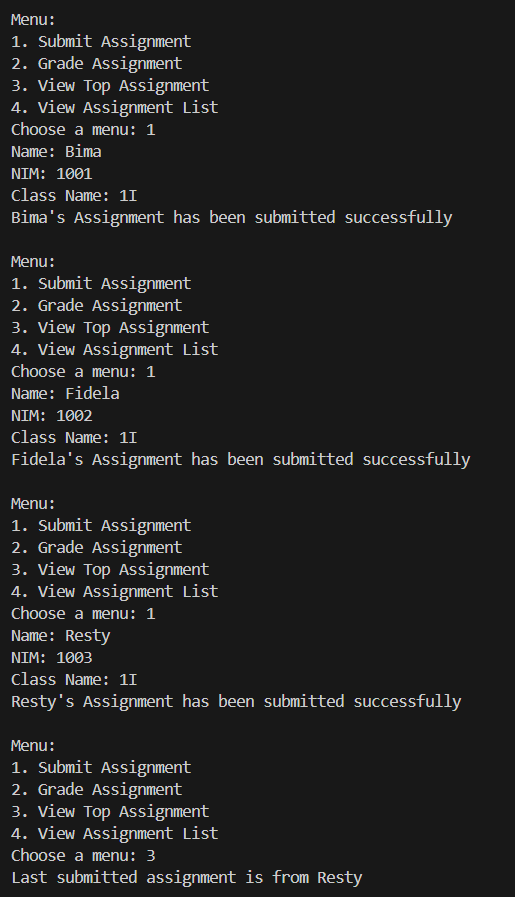
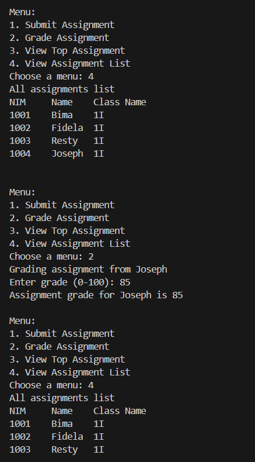
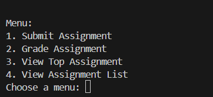
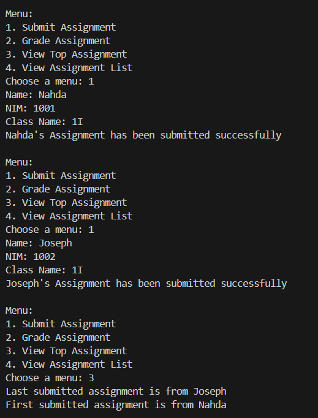
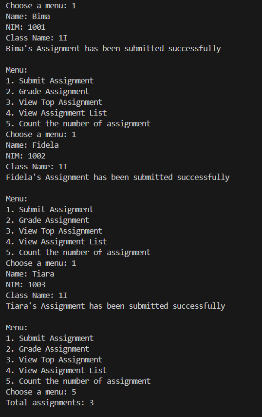
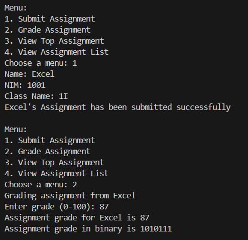

|  | Algorithm and Data Structure |
|--|--|
| NIM | 244107020242 |
| Nama | Joseph Atem Deng Aruei |
| Kelas | TI - 1I |
| Repository | [link](https://github.com/JosephAt10/Semester-Two) |

# Labs #10 Programming Fundamentals Review

## ** Experiment 2.1.1 Assignment Submission

1. The solution has been implemented in Student17.java and below is the screenshot of the result.





**Brief explanation:**
- A class named Student was created with attributes nim, name, className, and grade, along with a constructor to initialize them. The grade attribute is initialized to -1 to indicate ungraded assignments, and a grading() method is included to set the grade.
- A class named StudentAssignmentStack was implemented to represent a stack of student assignments. It includes the attributes stack, size, and top, and is initialized with a constructor that sets the maximum size and prepares the stack array.
- The isFull() and isEmpty() methods were implemented in StudentAssignmentStack to check the stack's capacity and whether it contains any data.
- A push() method was added to insert a Student object into the stack if it's not full. A pop() method removes and returns the top student from the stack, simulating assignment grading.
- A peek() method was created to return the student currently on top of the stack without removing them, and a print() method was included to display all student data stored in the stack.
- A main class named StudentDemo was created with a main() method to run the program. It initializes a StudentAssignmentStack object with a size of 5.
- A Scanner object named scan and an integer choice were declared to handle user input for interactive menu selection.
- A do-while loop was used to provide a menu-driven interface, allowing the user to perform stack operations such as submitting new student assignment, showing graded assignments, and viewing the assigments list.


## **2.1.3 Questions**
1. **Explain the role of the stack data structure in the student assignment management system. Why was a stack used instead of another data structure (e.g., queue or list)?**
- The stack data structure ensures that assignments are processed in LIFO (Last-In-First-Out) order, meaning the most recently submitted assignment is graded first. We choose stack because It simplifies implementation for sequential grading comapared to queue.
2. **What is the difference between the push() and pop() methods in a stack, and how are they used in this program?**
- push() method adds a new assignment to the top of the stack and Checks if the stack is full before insertion.
- pop() method removes and returns the topmost assignment for grading and Checks if the stack is empty before removal.

**How they are used**
- push() is called when a student submits an assignment.
- pop() is called when the lecturer grades an assignment.
3. **Why is it important to check the condition !isFull() before calling the push() method? What couldgo wrong if this check is removed?**
- Checking !isFull() ensures the stack has space for new items.
If this check is skipped it will lead to ArrayIndexOutOfBoundsException error.
4. **How many student assignments can be stored in the current implementation of the stack? Provide the specific line of code or variable that determines this.**
- The number of assignments is limited by the size of the array. This means the stack can hold up to 5 assignments.
```java
StudentAssignmentStack stack = new StudentAssignmentStack(5); // Max 5 assignments
```
5. **Modify the existing stack implementation so that the system can also show the first student who submitted their assignment. Describe the changes you made in both StudentDemo and StudentAssignmentStack classes.**

- The modification has been implemented in both StudentDemo and StudentAssignment and below is the result of the screenshot



**Brief explanation**
- A method named peekBottom() was added to the StudentAssignmentStack class to retrieve the first student who submitted an assignment by accessing the bottom of the stack (stack[0]), which is typically inaccessible in standard LIFO operations.
- The method checks if the stack is not empty using !isEmpty(), and if true, it returns the student object at index 0; otherwise, it returns null. 
- A line of code was added in studentDemo to call stack.peekBottom() and display the earliest submission. 
6. **Implement a method to count and return the number of assignments currently stored in the stack. Describe how your method works.**

- The solution has been implemented in StudentAssignmentStack and below is the screenshot of the result



**Brief Explanation**
- A method named countAssignments() was added to the StudentAssignmentStack class to calculate and return the total number of assignments currently stored in the stack.
- The method works by returning the value of top + 1, since the top index starts at -1 and increments with each push() operation, making it a direct way to count elements.
- A case 5 was added in the switch case in studentDemo to print out the calculation and a menu to choose was also added.
7. **What did you learn from this experiment about stack-based systems? Reflect on a real-world application where this kind of system might be useful.**
- I learned how a stack manages data in LIFO order and how that’s useful in systems where the most recent item needs attention first.

    **Real world application**
- Browser history
- Undo operations in text editors or drawing software.
- Call stack in program execution to manage function calls and returns.


## ** Experiment 2.2 Convert Assignment Grade to Binary

1. The solution has been implemented in StudentAssignmentStack17.java and below is the screenshot of the result.



**Brief explanation:**
- A method named convertToBinary(int grade) was added to the StudentAssignmentStack class to convert a student's grade into its binary representation.
- A new class named ConversionStack was created this class is a specialized stack that handles int data for binary conversion. It includes the standard stack operations: push(), pop(), isFull(), and isEmpty().
- The ConversionStack class uses a fixed-size array (binaryStack) of 32 integers to simulate a 32-bit binary conversion. The top pointer is initialized to -1, and the class prevents overflow or underflow with appropriate checks.
- After implementing convertToBinary(), a line was added in the StudentDemo class under case 2 (where assignments are graded) to automatically convert the student’s grade into binary and display the results.


## **2.2.3 Questions**
1. **Explain the workflow of the convertToBinary() method**
- Accepts an integer grade.
- Uses a temporary ConversionStack to store remainders of grade / 2.
- Pops remainders to construct the binary string (reversing the order).
- Returns the binary representation.
2. **In the convertToBinary() method, change the loop condition to while (grade != 0). What is the result? Explain the reason!**
- The result of the output will be the same as before however the while loop will not handle the negative grades and in this case, it would run infinitely.


## **2.4 Assignment**

1. The solution has been implemented in Excuses17.java and below is the screenshot of the result.


**Brief explanation**