|  | Algorithm and Data Structure |
|--|--|
| NIM | 244107020242 |
| Nama | Joseph Atem Deng Aruei |
| Kelas | TI - 1I |
| Repository | [link](https://github.com/JosephAt10/Semester-Two) |

# Labs #11 Programming Fundamentals Review

## ** Experiment 2.1.1 Queue Basic Operations

1. The solution has been implemented in Queue.java and below is the screenshot of the result.

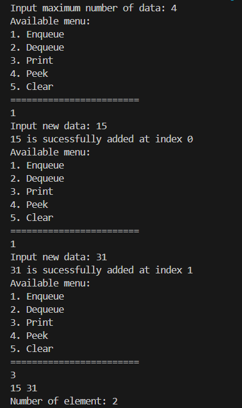
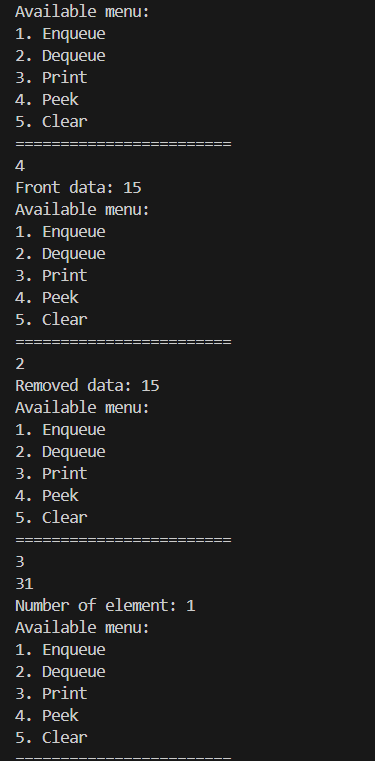

**Brief explanation:**
- A class named Queue was created with attributes data, front, rear, size, and max, and a constructor to initialize them for circular queue behavior.
- The main methods enqueue() and dequeue() were implemented to add and remove elements, updating front and rear accordingly.
- Methods isFull(), isEmpty(), peek(), print(), and clear() were added to check status, view elements, and reset the queue.
- A QueueMain class was created with a menu system using Scanner to let users interact with the queue through options like Enqueue, Dequeue, Peek, Print, and Clear.


## **2.1.3 Questions**
1. **In the constructor, why are the initial values of the front and rear attributes set to -1, while the size attribute is set to 0?**
- front and rear are initialized to -1 to indicate that the queue is empty and size is set to 0 because there are no elements in the queue initially.
2. **In the Enqueue method, explain the meaning and purpose of the following code snippet!**
```java
if (rear == max - 1) {
    rear = 0;
}
```
- This code checks if rear has reached the end of the array (max - 1). If true, it wraps rear back to 0, enabling a circular queue implementation.
3. **In the Dequeue method, explain the meaning and purpose of the following code snippet!**
```java
if (front == max - 1) {
    front = 0;
}
```
- This checks if front is at the end of the array. If true, it resets front to 0 to maintain circular behavior.
4. **In the print method, why does the loop variable i start from front instead of 0 (i.e., int i = 0)?**
- The queue elements are stored in a circular manner, so the first element is at front, not necessarily at index 0.
5. **Review the print method again, and explain the meaning of the following code snippet!**
```java
i = (i + 1) % max;
```
- This ensures that i moves circularly through the array. When i reaches max - 1, it wraps back to 0.
6. **Show the code snippet that represents a queue overflow!**
 ```java
if (size == max) {
    System.out.println("Queue is full!!!");
}
```
7. **When a queue overflow or underflow occurs, the program continues to run and only displays informational text. Modify the program so that it stops when a queue overflow or underflow happens!**
```java
void enqueue(int dt) {
    if (isFull()) {
        System.out.println("Queue overflow! Exiting...");
        System.exit(1);
    }
    // Rest of the code...
}
```

## ** Experiment 2.2.1 Academic Service Queue

1. The solution has been implemented in StudentQueue.java and below is the screenshot of the result.

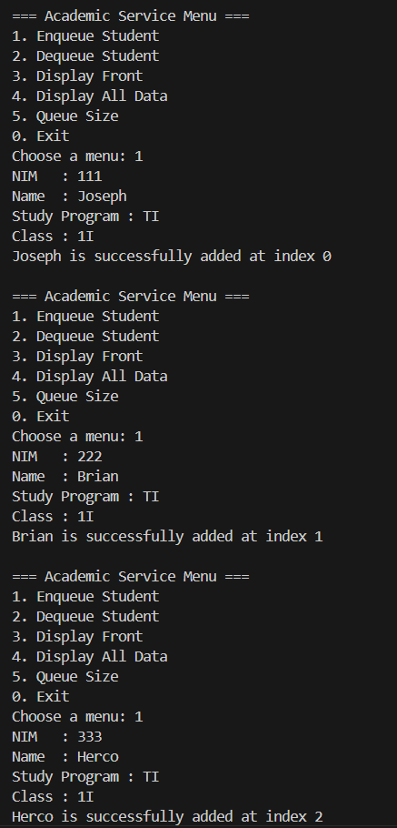
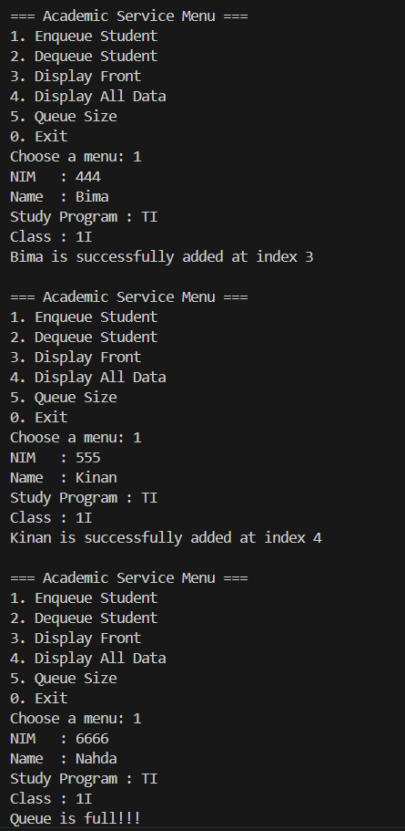
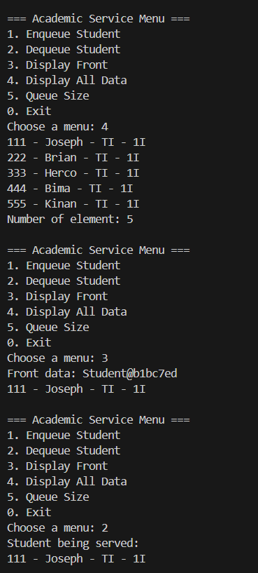
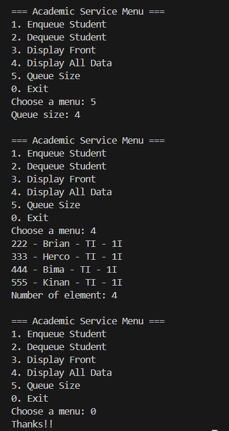

**Brief explanation:**
- A Student class was created with attributes nim, name, studyProgram, and className, along with a constructor and a print() method to display student data.
- A StudentQueue class was implemented using a circular array of Student objects. It includes front, rear, size, and max to manage queue positions and capacity.
- The enqueue() method inserts a new student at the rear using circular logic, while dequeue() removes the student from the front and returns the object.
- Methods isEmpty(), isFull(), clear(), peek(), and print() were provided to manage and view the queue state and contents.
- The peek() method displays the student at the front, and print() iterates through the queue to display all students using the Student.print() method.
- The StudentQueueMain class provides a menu-driven interface using Scanner, allowing users to enqueue, dequeue, view front data, print all data, and check queue size.


## **2.1.3 Questions**
1. **What is the main difference between the Queue (experiment 1) and StudentQueue classes interms of the data type they manage? Why is this change in data type important?**
- Queue uses an int[] array to store integers While StudentQueue uses a Student[] array to store objects of the Student class.
2. **How do the enqueue and dequeue methods in StudentQueue differ from those in Queue?**
- In Queue, enqueue(int dt) inserts an integer while In StudentQueue, enqueue(Student dt) inserts a Student object.
3. **Examine the constructor of the StudentQueue class: why is the front attribute initialized to 0, whereas in the Queue class from Experiment 1, the front attribute is initialized to -1?**
- In the Queue class, front = -1 shows that the queue is empty at the start. This helps us know when the first item is added. In the StudentQueue class, front = 0 is used instead because the queue uses circular logic with modulo, and the size variable is enough to check if the queue is empty. So, there's no need to use -1.
4. **Modify the program by adding a new method called viewRear() in the StudentQueue class to check the queue element at the rear position. Also, update the menu in the StudentQueueMain class by adding option 6: “Check rear of the queue,” so that the viewRear() method can be invoked.**
```java
public void viewRear() {
    if (!isEmpty()) {
        System.out.println("Rear data:");
        data[rear].print();
    } else {
        System.out.println("Queue is empty!");
    }
}
             //In studentQueueMain
System.out.println("6. Check rear of the queue");
//rest of the code
case 6:
    queue.viewRear();
    break;
```


## **2.4 Assignment**

1. The solution has been implemented in Student17.java and below is the screenshot of the result.

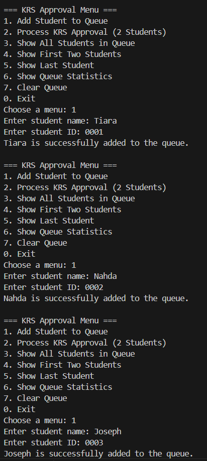
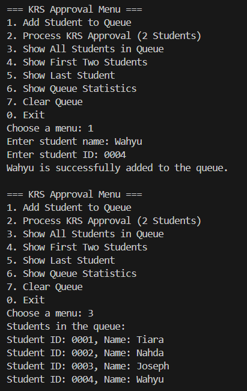
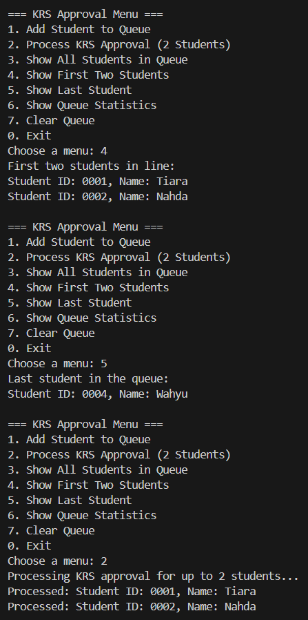
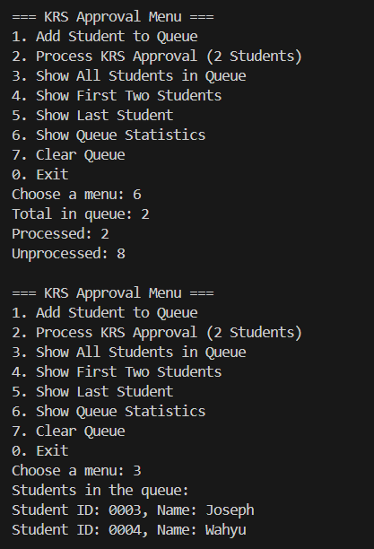
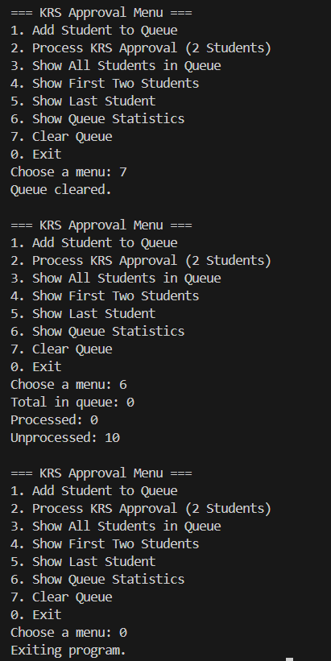

**Brief explanation:**
- A class named Student17 was created with attributes name and id, along with a constructor to initialize these attributes and a method print() to display student information.
- A class named StudentQueue17 was created with attributes data, front, rear, size, max, and processedCount, and a constructor to initialize them for circular queue behavior with a maximum size of 10.
- The methods enqueue(Student dt) and dequeue() were implemented to add and remove Student objects from the queue, updating the front and rear indices accordingly while managing the size of the queue.
- Methods isFull(), isEmpty(), clear(), peekFirstTwo(), peekLast(), and printQueue() were added to check the queue's status, view specific elements, and reset the queue as needed.
- A Main class was created with a menu system using Scanner to let users interact with the queue through options like adding a student to the queue (enqueue), processing KRS approval (dequeue), showing all students in the queue, displaying the first two students in line, showing the last student in the queue, and printing the total number of students in the queue.

### **THANK YOU!!**