|  | Algorithm and Data Structure |
|--|--|
| NIM | 244107020242 |
| Nama | Joseph Atem Deng Aruei |
| Kelas | TI - 1I |
| Repository | [link](https://github.com/JosephAt10/Semester-Two) |

# Labs #12 Programming Fundamentals Review

## ** Experiment 2.1 Implementing Single Linked List

1. The solution has been implemented in Student00.java and below is the screenshot of the result.

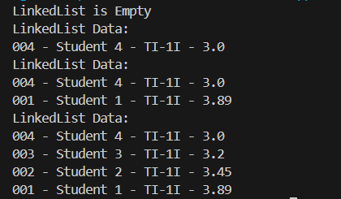

**Brief explanation:**
- A class named Student00 was created to represent student data with attributes nim, name, className, and gpa, along with a print() method to display the information.
- A Node00 class was implemented to create nodes for the linked list, each holding a Student00 object and a reference to the next node.
- The SingleLinkedList00 class was built to manage a singly linked list using head and tail, with methods such as addFirst(), addLast(), insertAfter(), insertAt(), isEmpty(), and print() for common list operations.
- A SLLMain00 class was created with a main method to demonstrate list usage, including adding and inserting students, and printing the list after each operation.


## **2.1.2 Questions**
1. **Why does compiling the program code result in the message "Linked List is Empty" on the first line?**
- Because initially, no data has been added to the linked list. The print() method is called before any insertion, and since head is null, the list is considered empty.
2. **Explain the general purpose of the variable temp in each method!**
- The variable temp is used as a temporary pointer to traverse the linked list starting from the head. It allows iteration through each node to perform actions like searching, inserting, or deleting at a specific position.
3. **Modify the code so that data can be added via keyboard input!**

- The modification has been implemented in SLLMain00.java and below is the screenshot of the result.

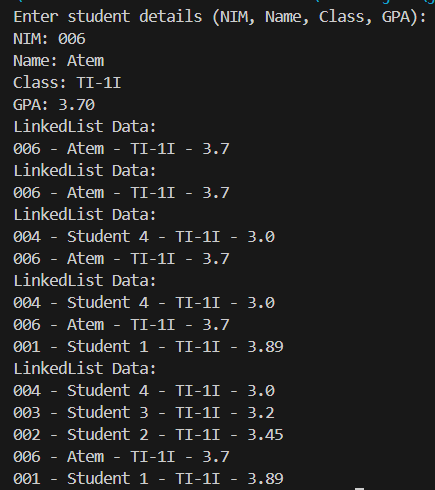

**Brief explanation:**
- A Scanner object was created to read user input from the keyboard for student details such as NIM, Name, Class, and GPA.
- The input values were stored in variables and used to create a new Student00 object with the constructor.
- The new student object was then added to the linked list using addLast(), and print() was called to display the updated list.

4. **What would happen if we did not use the tail attribute? Would it affect the code implementation? Please explain.**
- Yes, it would slightly affect performance and complexity. Without tail, adding to the end of the list (like in addLast()) would require traversing the entire list from head to find the last node every time, resulting in O(n) time complexity. With tail, the operation is O(1) since it provides direct access to the last node however it's not a must for the tail attribute to be use.


## ** Experiment 2.2 Accessing Element in Single Linked List

1. The solution has been implemented in SLLMain00.java and below is the screenshot of the result.

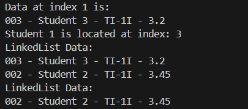

**Brief explanation:**
- A method getData(int idx) was added to retrieve a Student00 object at a specific index, and indexOf(String key) was introduced to find the position of a student by name.
- Methods removeFirst() and removeLast() were implemented to delete the first and last elements from the linked list, updating head and tail as needed.
- The remove(String key) method allows removal of a student node by name, handling cases where the node is at the beginning, middle, or end of the list.
- A removeAt(int index) method was added to remove a node at a specific index, and the main method was updated to demonstrate these functionalities with retrieval, searching, and multiple types of deletions.


## **2.2.3 Questions**
1. **Why is the break keyword used in the remove function? Explain!**
- The break keyword is used to stop the loop once the targeted node (the one to be removed) is found and removed. 
2. **Explain the purpose of the code below in the remove method.**
```java
temp.next = temp.next.next;
if (temp.next == null){
    tail = temp;
}
```
- temp.next = temp.next.next; removes the node after temp by bypassing it, effectively deleting it from the list.
- if (temp.next == null) checks if the deleted node was the last one. If so, it updates the tail pointer to point to the new last node (temp) to maintain correct list structure.


## **Assignments**

1. The solution has been implemented in StudentServiceQueue.java and below is the screenshot of the result.

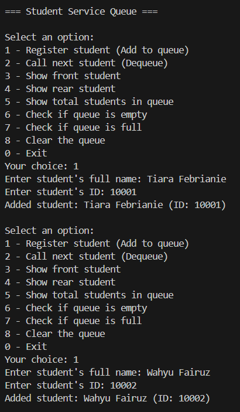
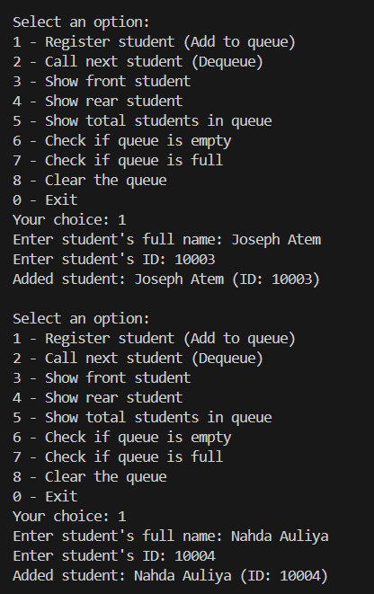
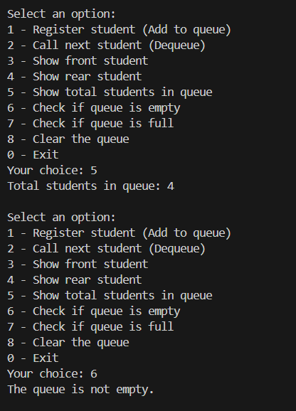
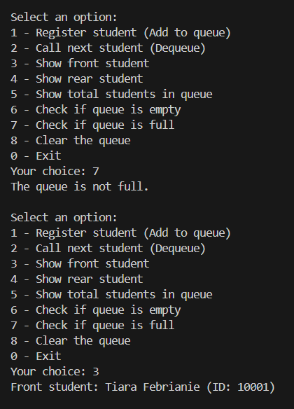
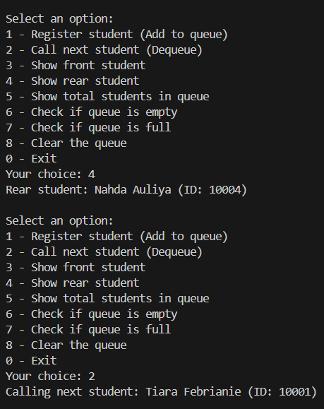
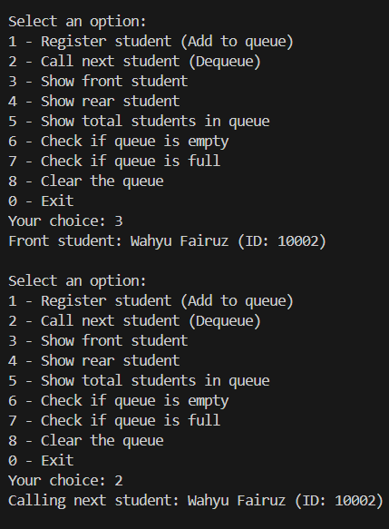
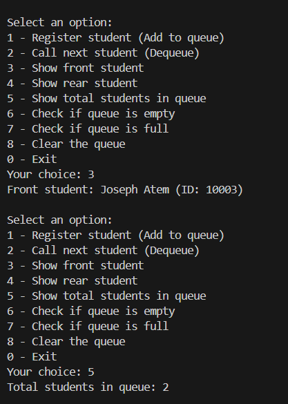
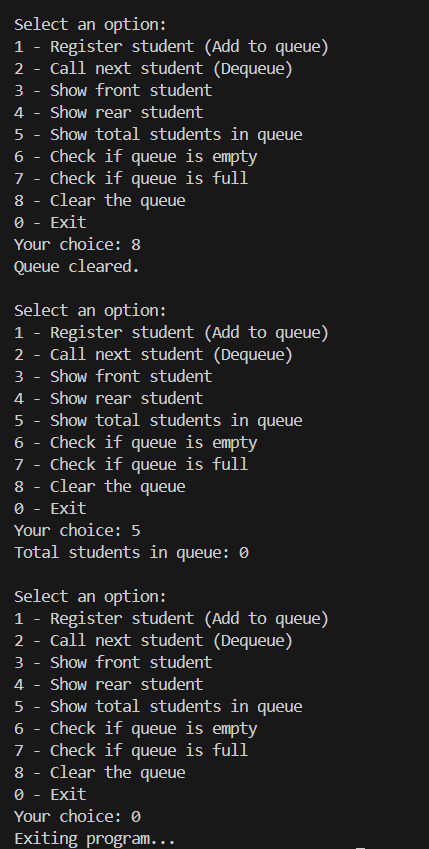

**Brief explanation:**
- A Student class was created with attributes name and id, and a printInfo() method was implemented to display student details.
- A Node class was designed to hold a Student object and a reference to the next node, forming the building block of the linked list queue.
- A LinkedListQueue class was implemented with attributes front, rear, size, and maxSize to manage queue operations and limit capacity.
- The queue supports key operations including enqueue(), dequeue(), getFront(), getRear(), getSize(), isEmpty(), isFull(), and clear() for managing student data.
- The StudentServiceQueue class was created with a main() method to serve as the user interface for interacting with the queue system.
- A menu-driven interface was implemented using Scanner, allowing users to select options for registering, viewing, and processing students in the queue.
- The option to register a student prompts the user to input name and ID, creates a Student object, and enqueues it if the queue is not full.
- Functions were provided to view the front and rear students, check if the queue is empty or full, display the total number of students, and clear the queue.
- The program includes proper input validation and handles empty or full queue conditions with user-friendly messages, ensuring a strong and interactive experience.

### **THANK YOU!!**