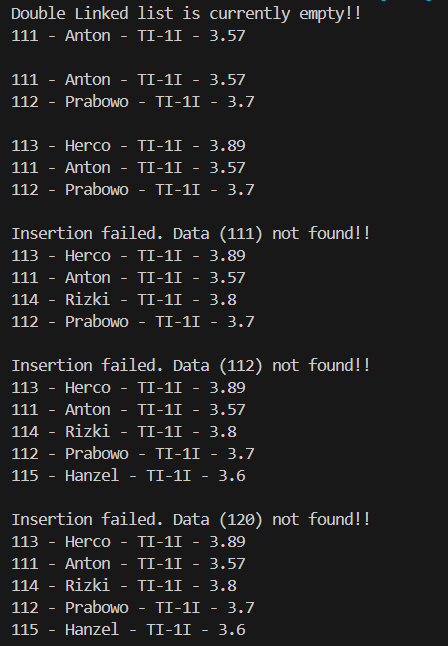
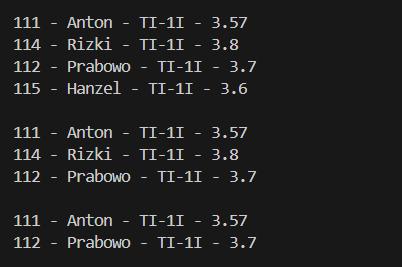
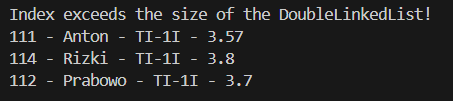
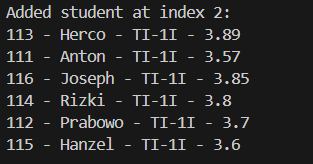
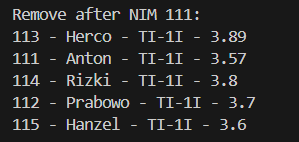
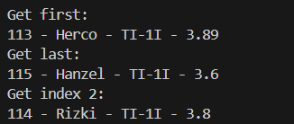
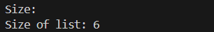
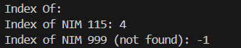

|  | Algorithm and Data Structure |
|--|--|
| NIM | 244107020242 |
| Nama | Joseph Atem Deng Aruei |
| Kelas | TI - 1I |
| Repository | [link](https://github.com/JosephAt10/Semester-Two) |

# Labs #13 Programming Fundamentals Review

## ** Experiment 2.1 Implementing Double Linked List

1. The solution has been implemented in Student.java and below is the screenshot of the result.



**Brief explanation:**
- A class named Student was created with attributes nim, name, className, and gpa, along with constructors to initialize them. A print() method was also provided to display a student's data in a formatted way.
- A class named Node was implemented to represent a node in a double linked list. It contains a Student object as its data, and references to the previous (prev) and next (next) nodes. Three constructors were defined for flexibility when creating nodes.
- A class named DoubleLinkedLists was developed to manage a list of student nodes. It contains head and tail pointers and methods like addFirst(), addLast(), and insertAfter() for inserting student data at the front, end, or after a specific student by NIM.
- The isEmpty() method checks if the list is empty, and the print() method displays all student data from head to tail. The insertAfter() method includes error handling if the specified key is not found in the list.  
- A main class named DoubleLinkedListsMain was created with a main() method to run and test the linked list functionality. It demonstrates inserting students at different positions and displays the list after each operation using the print() method. 


  ## **2.3 Questions**
1. **Explain the difference between a singly linked list and a doubly linked list.**
  - In singly linked list, each node has only a next pointer, allowing traversal in one direction only(forward) Mean while in doubly linked list, Each node has both next and prev pointers, allowing traversal in both forward and backward directions.

2. **Observe the Node class, which contains the attributes next and prev. What are the purposes of these attributes?**
  - next: points to the next node in the list.
  - prev: points to the previous node, enabling reverse traversal.

3. **Examine the constructor in the DoubleLinkedLists class. What is the purpose of this constructor?**
  ```java
  DoubleLinkedlists(){
    head = null;
    tail = null;
  }
  ```
  - The purpose of the constructor is to initializes an empty list by setting head and tail to null.

4. **In the addFirst() method, what is the meaning of the following code?**
  ```java
  if (isEmpty()){
    head = tail = newNode;
  }
  ```
  - If the list is empty, both head and tail point to the new node since it's the only node.

5. **In the addFirst() method, what does the statement head.prev = newNode mean?**
- Sets the previous pointer of the current head node to point to the new node being added at the front.

6. **In the insertAfter() method, what is the meaning of current.next.prev= newNode?**
-  Updates the prev pointer of the node following the current node to point to the new node being inserted.

7. **In the experiment 1 code, in which method the traversal process implemented? What is the meaning of temp = temp.next ?**
- The traversal process is implemented in the print() method. temp = temp.next moves the temporary pointer to the next node in the list during traversal.

8. **In the insertAfter() method, what is the following code for?**
```java
if (temp == tail){
    addLast();
}
```
- If the key is found at the tail node, it uses the existing addLast() method to insert the new data.

- **Do we have to implement it? What if we remove it?**
-  This is necessary to maintain proper tail references. If removed, we would need to manually update tail references in this case.

9. **In the insertAfter() what is this statement if(temp.data.nim equalsIgnoreCase(key)) for?**
To find the node with the matching nim before inserting the new node after it.


## ** Experiment 2.2 Deleting elements from Double Linked List

1. The solution has been implemented in DoubleLinkedLists.java and below is the screenshot of the result.



**Brief explanation:**
- The removeFirst() method was added to the DoubleLinkedLists class to remove the node at the beginning of the list. It handles cases where the list is empty or has only one node, and adjusts the head pointer and prev link accordingly.
- A removeLast() method was implemented to remove the last node in the list. Similar to removeFirst(), it updates the tail pointer and ensures the previous node becomes the new tail when the list contains more than one node.
- A remove(int index) method was created to delete a node at a specific index in the list.
- Additional test calls were made in the main() method of DoubleLinkedListsMain, including dll.removeFirst(), dll.removeLast(), and dll.remove(1), each followed by dll.print() to visually confirm the effects of each deletion on the list structure.


  ## **3.3 Questions**
1. **What is the use of the following statement in the removeFirst() method?**
```java
head = head.next;
head.prev = null;
```
- Moves the head pointer to the next node and removes the previous reference of the new head, effectively removing the first node from the list.

2. **Why is it important to include conditions and processes like the ones below in bot emoveFirst() and removeLast() methods? Explain!**
```java
else if(head == tail){
    head = tail = null;
}
```
- This condition handles the case when there's only one node left, ensuring the list becomes completely empty.

3. **In the removeLast() method, if there is no tail attribute inside DoubleLinkedLists class, what approach or changes need to be made to the code of the method?**
- Without a tail attribute, we would need to traverse the entire list to find the second-to-last node, then set its next pointer to null.

4. **What is the purpose of the initial if(isEmpty()) check in the remove(int index) method?**
- Prevents attempts to remove nodes from an empty list, which would cause null pointer exceptions.

5. **Explain how the method handles the removal of a node at the beginning (index ==0) and at the end (temp == tail) of the linked list.**
- For index 0: Calls removeFirst() to handle head updates
- For tail node: Calls removeLast() to handle tail updates

6. **Describe how the method updates the links between nodes when removing a node from the middle of the linked list**
- Sets the next pointer of the previous node to skip over the removed node
- Sets the prev pointer of the next node to point to the node before the removed one

7. **The remove(int index) method currently does not check for negative index or index that exceed the size of the DoubleLinkedLists. Please add statements to handle these cases.**

1. The modification has been implemented in doubleLinkedList and below is the screenshot



**Brief explanation:**
- A remove(int index) method was modified to includes validation for negative indices, indices exceeding the list size.
- A size() method was added to calculate and return the total number of nodes in the list by traversing it from head to tail. This method is essential for validating index bounds in remove(int index).

## **Assignments**

- The solution has been implemented in DoubleLinkedLists.java and below is the screenshot of the result.

1. *Add an add() function to the DoubleLinkedList class to insert a node at a specific index.*



2. *Add a removeAfter() function to the DoubleLinkedList class to delete the node that comes after the node containing a specified key*



3. *Add the methods getFirst(), getLast(), and getIndex() to retrieve data from the head node, tail node, and node at a specific index, respectively*



4. *Add a method getSize() to return the number of DoubleLinkedLists data!*



5. *Add method indexOf() to return the index of a specific data specified by key (nim)!*




### *THANK YOU!!*