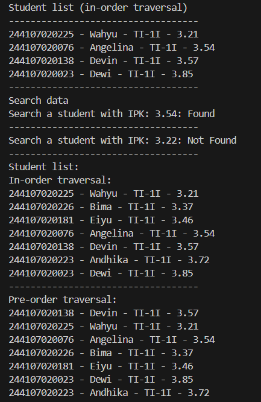
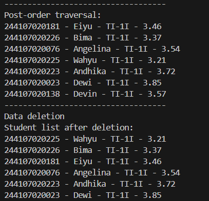
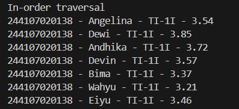
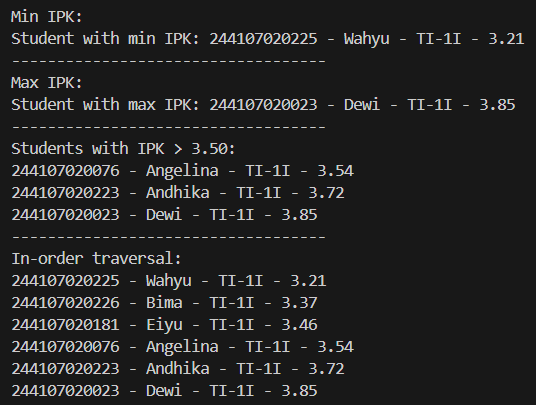
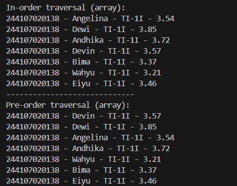

|  | Algorithm and Data Structure |
|--|--|
| NIM | 244107020242 |
| Nama | Joseph Atem Deng Aruei |
| Kelas | TI - 1I |
| Repository | [link](https://github.com/JosephAt10/Semester-Two) |

# Labs #14 Programming Fundamentals Review

## ** Experiment 2.1 Implementation of Binary Search Tree Using Linked List

1. The solution has been implemented in BinaryTree00.java and below is the screenshot of the result.




**Brief explanation:**
- A class Student00 was created with attributes nim, name, className, and ipk (GPA) and a constructors (default and parameterized) to initialized these attributes, and a print() method formatted the output for display.
- The Node00 class was implemented with Student00 data and left/right child pointers to form the BST structure.
- The BinaryTree00 class handled core operations like adding nodes by GPA, searching, deleting, and performing all three traversal types.
- BinaryTreeMain00 tested the BST by adding students, searching by GPA, and showing traversal results before and after deletions.


## **2.2 Questions**
1. **Why is data search in a binary search tree more efficient compared to a regular binary tree?**
- In a binary search tree (BST), elements are organized based on their values (left subtree contains smaller values, right subtree contains larger values). This organization allows for efficient searching using binary search principles (O(log n) in balanced trees), while in a regular binary tree without ordering, we would need to search all nodes (O(n)).
2. **What are the purposes of the left and right attributes in the Node class?**
- The left and right attributes are references to the left and right child nodes respectively, forming the tree structure by linking nodes together.
3. **a. What is the function of the root attribute in the BinaryTree class?**
- The root attribute is a reference to the topmost node of the binary tree, serving as the entry point for all tree operations.
3. **b. When a BinaryTree object is first created, what is the initial value of root?**
- The initial value of root is null, indicating an empty tree.
4. **When the tree is empty and a new node is to be added, what process takes place?**
- When the tree is empty (root == null), the new node becomes the root of the tree.
5. **Consider the following line of code inside the add() method. Explain in detail the purpose of this line of code**
```java
if(data.ipk < current.data.ipk){
 if(current.left != null){
 current = current.left;
 } else {
 current.left = new Node00(data);
 break;
 }
} else if(data.ipk > current.data.ipk){
 if(current.right != null){
 current = current.right;
 } else {
 current.right = new Node00(data);
 break;
 }
}
```
- If the new data's IPK is less than the current node's IPK, it moves to the left child if it exists, otherwise inserts the new node as the left child.
- If the new data's IPK is greater than the current node's IPK, it moves to the right child if it exists, otherwise inserts the new node as the right child.
- The process continues until it finds the appropriate empty spot to insert the new node.
6. **Explain the steps involved in the delete() method when removing a node that has two children. How does the getSuccessor() method assist in this process?**
- Find the node's successor (the smallest node in the right subtree) using getSuccessor().
- Replace the node to be deleted with its successor.
- Adjust the successor's parent's left pointer to point to the successor's right child (if any).
- The successor's left child becomes the left child of the node being deleted.
- The getSuccessor() method helps by finding the appropriate node to replace the deleted node while maintaining the BST property.


## ** Experiment 3.1 Implementation of Binary Tree Using Array

1. The solution has been implemented in BinaryTreeArray17.java and below is the screenshot of the result.



**Brief explanation:**
- BinaryTreeArray00 used an array to store student data and tracked the last index with idxLast.
- The populateData() method initialized the tree with a predefined array of students.
- The traverseInOrder() method recursively visited nodes using array index calculations for left and right children.
- BinaryTreeArrayMain00 demonstrated the array-based tree by loading student data and displaying the in-order traversal output.


## **3.2 Questions**
1. **What is the purpose of the data and idxLast attributes in the BinaryTreeArray class?**
- data: An array that stores the elements of the binary tree.
- idxLast: An integer that keeps track of the last occupied index in the array.
2. **What is the function of the populateData() method?**
- It initializes the binary tree with an existing array of data and sets the idxLast to the last index of the provided array.
3. **What is the purpose of the traverseInOrder() method?**
- It performs an in-order traversal (left-root-right) of the binary tree stored in the array and prints the data.
4. **If a binary tree node is stored at index 2 in the array, at which indices are its left and right children located, respectively?**
- Left child: 2 * 2 + 1 = index 5
- Right child: 2 * 2 + 2 = index 6
5. **What is the purpose of the statement int idxLast = 6 in Experiment 2, step 4?**
- It indicates that the last element in the array is at index 6 (for an array of 7 elements with indices 0-6).
6. **Why are the indices 2 * idxStart + 1 and 2 * idxStart + 2 used in the recursive calls, and how do they relate to the structure of a binary tree represented as an array?**
- These formulas calculate the indices of the left and right children of a node at index idxStart in the array representation of a complete binary tree.


## **Assignments**

1. The solution has been implemented in BinaryTree00.java and BinaryTreeArray17.java and below are the screenshots of the results.




**Brief explanation:**
- A recursive addRekursif() method was added to BinaryTree00 for alternative node insertion.
- The getMinIPK() and getMaxIPK() methods were implemented to find students with lowest and highest GPAs.
- The displayStudentsWithIPKAbove() method showed students exceeding a specified GPA threshold.
- BinaryTreeArray00 was enhanced with add() for dynamic insertion and traversePreOrder() for additional traversal capability.


### *THANK YOU!!*