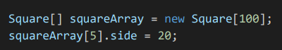
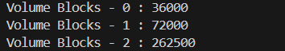

|  | Algorithm and Data Structure |
|--|--|
| NIM | 244107020242 |
| Nama | Joseph Atem Deng Aruei |
| Kelas | TI - 1I |
| Repository | [link](https://github.com/JosephAt10/Semester-Two) |

# Labs #3 Programming Fundamentals Review

## **2.1 Experiment 1.2: Create, insert, and display Array of Object

1. The solution is implemented in ArrayOfObject.java, and below is screenshot of the result

**Brief explanaton:**
- An array of rectangle objects is created in the main method with a length of 3.
- Each object in the array is instantiated and values for length and width are assigned
- A loop to prints the length and width of each rectangle object in the array

### **1.2.3 Questions**

1. **Based on part 1.2, does the class that are going to be used as an array of object must have attributes and methods, please explain**
- Yes, it should have attributes to store data and methods for data manipulation.

2. **Does class Rectangle have constructor? if not, why do we intantiate the object as follow?**
- The Rectangle class does not have an explicit constructor. Java provides a default constructor when no constructor is defined, which allows us to instantiate objects using new Rectangle().

3. **What is the meaning of this line of code?**

- This line creates an array named rectangleArray that can hold 3 Rectangle objects. However, the objects themselves are not yet instantiated.

4. **what's the meaning of this line of code?**

- These lines instantiate a Rectangle object at index 1 of the rectangleArray and assign values to its length and width attributes.

5. **why ArrayOfObject class and rectangle class should be seperated?**
- For the code to be reuse and more structured

## **2.1 Experiment 1.3: Input data into Array of Objects using loop

1. The solution is implemented in ArrayOfObject.java, and below is screenshot of the result

**Brief explanaton:**
- Import scanner to prompt user input
- A FOR loop to access element of ppArray and print them to the screen

### **1.3.3 Questions**

1. **Does array of object be implemented on 2D array?**
- Yes, a 2D array of objects can be implemented.

2. **If yes then give example otherwise please explain?**
- Below is the example

3. **There is a square class that has an attribute side with integer as it's data type. there will be an error when we run this code, why?**

- Because the square object at index 5 is not intantiated.

4. **Modify the code on part 1.3 so that the length of the array will be defined from user input**

- Below is the modification

**Brief explanation:**
- Creates a Scanner object to read user input.
- Prompts the user to enter the number of rectangles.
- Reads the input and stores it in variable n.
- Creates an array of Rectangle objects with size 3.

5. **Can we duplicate the instantiation process in array of object? for example, we assign the object in pparray[i] and pparray[0], the instantiation process of pparray[0] will be done twice. what's the effect of this?**
-  Yes we can duplicate the instantiation but it will overwrites the previous reference leading to data loss.

## **2.1 Experiment 1.4: Mathematical operation in array of object's attribute

1. The solution is implemented in blocks.java, and below is screenshot of the result

**Brief explanation:**
- A blocks class with attributes width, length, and height and a method calculate volume were created.
- Array of block was Instantiated with a size of 3.
- The values were assigned using a constructor.

### **1.4.3 Questions**

1. **Can we have more than one constructor in one class? Please explain**
- Yes, a class can have multiple constructors as long as they have different parameter lists.

2. ## **The triangle class**
- The solution is implemented in Triangle.java, and below is screenshot of the result

**Brief explanation:**
- A class of triangle was created with methods and constuctor.
- An array of triangle object was instantiated.
- A FOR loop was implemented to display the area and perimeter for each triangle.

## **Assignment 1 solution**
1. The solution is implemented in lecturer.java, and below is screenshot of the result

**Brief explanation:**
- A Lecturer class was created with attributes: id, name, gender, and age, along with a constructor to initialize them.
- A display method was added to the Lecturer class to print lecturer details.
- A LecturerDemo class was created to handle user input and manage lecturer data.
- FOR and FOREACH loops were used in LecturerDemo to create and display an array of Lecturer objects.
- Methods were implemented in LecturerDemo to display all lecturers, count lecturers by gender, and calculate the average age based on gender.
- Additional methods were implemented to identify and display the oldest and youngest lecturers in the dataset.

## **THANK YOU!!!**           

