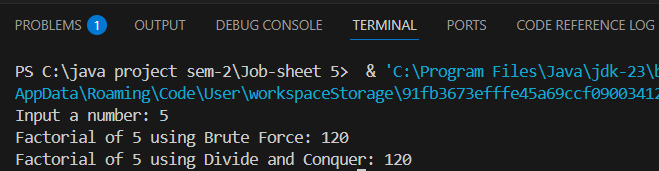
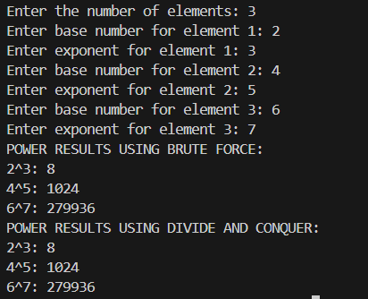
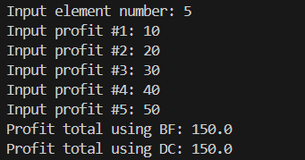
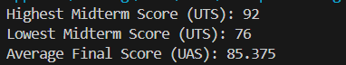

|  | Algorithm and Data Structure |
|--|--|
| NIM | 244107020242 |
| Nama | Joseph Atem Deng Aruei |
| Kelas | TI - 1I |
| Repository | [link](https://github.com/JosephAt10/Semester-Two) |

# Labs #5 Programming Fundamentals Review

## ** Experiment 5.2.1 Calculating Factorial Using Brute Force and Divide and Conquer Algorithms

1. The solution is implemented in factorial.java, and below is screenshot of the result.



**Brief explanaton:**
- A class named Factorial was created with the required attributes and methods as per the class diagram.
- Two methods, faktorialBF() (Brute Force) and faktorialDC() (Divide and Conquer), were implemented within the Factorial class.
- A new class named MainFaktorial was created to run the program, and a main() function was added to take user input.
- An object of the Factorial class was created in MainFaktorial, and both factorialDC() and factorialBF() methods were called to compute the factorial.


### **5.2.3 Questions**
1.  **In the base of the divide conquer algorithm for calculating factorial, explain the differences in the code structure between the if and else conditions?**

- The `if` condition checks for the smallest case (e.g., `n == 1`), while the `else` condition breaks the problem into smaller parts and solves it recursively.

2. **Is it possible to modify the loop in the factorialBF() method to use an alterative to the for loop? please explain and givd examples if needed!**

- The for loop in factorialBF() can be replaced with a while loop because both are iterative structures that perform the same task: multiplying numbers from 1 to n. The for loop is concise for fixed iterations, while the while loop is more flexible but equally valid here. Both achieve the same result, so the choice depends on coding style.

 ```java
  int factorialBF(int n) {
      int facto = 1;
      int i = 1;
      while (i <= n) {
          facto = facto * i;
          i++;
      }
      return facto;
  }
```
3. **Please explain the difference between facto = facto*i; and int facto = n * factorialDC(n-1);!**

- `facto = facto * i;` is an iterative approach using loops.
- `int facto = n * factorialDC(n-1);` is a recursive approach, breaking the problem into smaller pieces.

4. **Make a conclusion about the differences in how each method works. factorialBF and factorialDC()!**

- `factorialBF()`: Iterative approach, simple and straightforwad, Suitable for small inputs
- `factorialDC()`: Recursive approach, break problem into smaller subproblems, efficient for large `n`.


## ** Experiment 5.3.1 Calculating Exponentiation Using Brute Force and Divide and Conquer Algorithms

1. The solution is implemented in Power.java, and below is screenshot of the result.



**Brief explanaton:**
- A class named Power was created with attributes baseNumber and exponent, and methods powerBF() (Brute Force) and powerDC() (Divide and Conquer) to compute exponentiation.
-  A PowerMain class was created to take user input, create an array of Power objects, and compute exponentiation using both powerBF() and powerDC() methods.
- The Brute Force approach (powerBF) uses iteration to multiply the base number exponent times, while the Divide and Conquer approach (powerDC) uses recursion to optimize the computation.
-  The program outputs the results of exponentiation for each element using both approaches.


### **5.3.3 Questions**

1. **Explain the difference between the two methods created powerBF() and powerDC()?**
- `powerBF()`: Multiplies the base repeatedly, while `powerDC()`: Uses recursion to reduce the number of multiplications.

2. **Does the combine stage exist in the provided code? show the relevant part**
- The combine stage exists in the powerDC() method. For example:

```java
if (e % 2 == 1) {
    return (powerDC(n, e/2) * powerDC(n, e/2) * n);
} else {
    return (powerDC(n, e/2) * powerDC(n, e/2));
}
```
3. **In the powerBF() method, parameters are used to pass the base number and its exponent, even though the power class already contains attributes for these values(base number and exponent attribute). Do you think it is still relevant for the method to have parameters? could the method be implemeented without parameters instead? if so, how would the powerBF() method  be structured without parameters?**
- The parameters in powerBF() are relevant because they allow the method to be flexible and reusable for any base and exponent values. However, the method could be implemented without parameters by using the class attributes baseNumber and exponent. For example:

```java
int powerBF() {
    int result = 1;
    for (int i = 0; i < this.exponent; i++) {
        result = result * this.baseNumber;
    }
    return result;
}
```

4. **Summarize how the powerBF() and powerDC method works!**

Brute Force (powerBF):
- Iterative approach.
- Multiplies the base number e times.
- Simple but less efficient for large exponents.

Divide and Conquer (powerDC):
- Recursive approach.
- Divides the problem into smaller subproblems.
- Optimized for large exponents with O(log n) complexity.


## ** Experiment 5.4.1 Calculating Array Sum Using Brute Force and Divide and Conquer Algorithms

1. The solution is implemented in Sum.java, and below is screenshot of the result.



**Brief explanaton:**
- A class named Sum was created with an array profits[] to store profit values, and methods totalBF() (Brute Force) and totalDC() (Divide and Conquer) to calculate the total sum.
- A SumMain class was created to take user input for the number of elements and profit values, and compute the total profit using both totalBF() and totalDC() methods.
- The Brute Force approach (totalBF) uses iteration to sum all elements in the array, while the Divide and Conquer approach (totalDC) uses recursion to divide the array into smaller subarrays and combine their sums.
- The program outputs the total profit calculated using both approaches.

### **5.4.3 Questions**

1. **Why is mid variable needed in totalDC()method?**
- The mid variable is used to divide the array into two halves for the Divide and Conquer approach. It helps in splitting the problem into smaller subproblems.
2. **Explain the following statements in totalDC() method**

```java
double lsum = totalDC(arr, l, mid);  
double rsum = totalDC(arr, mid + 1, r);
```
- The first line of code recursively calculates the sum of the left half of the array, while the second line of code recursively calculates the sum of the right half of the array

3. **Why is it necessary to sum the results of Isum and rsum as shown below**
```java
return lsum + rsum;
```
- The results of the left and right halves (lsum and rsum) are summed to combine the solutions of the subproblems and get the total sum of the array.

4. **What is the base case of totalDC() method?**
- The base case is when l == r, meaning there is only one element in the array. In this case, the method returns arr[l].

5. **Draw a conclusion about how totalDC() works!**

Divide and Conquer (totalDC):
- Recursively divides the array into smaller subproblems.
- Combines the results of the subproblems to get the total sum.
- Efficient for large datasets due to its O(log n) complexity.


## **Assignment solution**

1. The solution is implemented in Student.java, and below is screenshot of the result



**Brief explanaton:**
- A class named Student was created with attributes name, studentID, year, midtermScore, and finalScore to store student data.
-  A class named StudentMain was created with methods findMaxMidtermScore() and findMinMidtermScore() using Divide and Conquer to find the highest and lowest midterm scores, and calculateAverageFinalScore() using Brute Force to calculate the average final score.
- The Divide and Conquer approach divides the array of students into smaller subarrays to find the maximum and minimum midterm scores, while the Brute Force approach iterates through the array to calculate the average final score.
- The program outputs the highest midterm score, lowest midterm score, and average final score for the given student data.


## **THANK YOU!!!** 