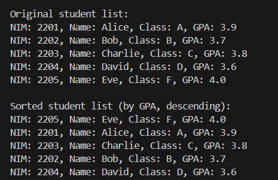

|  | Algorithm and Data Structure |
|--|--|
| NIM | 244107020242 |
| Nama | Joseph Atem Deng Aruei |
| Kelas | TI - 1I |
| Repository | [link](https://github.com/JosephAt10/Semester-Two) |

# Labs #6 Programming Fundamentals Review

## ** Experiment 6.2.1 Implementing Sorting Using Objects

## **Sorting - Bubble Sort**

1. The solution is implemented in Sorting17.java, and below is screenshot of the result.


**Brief explanaton:**
- A class named Sorting17 was created with the required attributes and a constructor with parameters.
- BubbleSort method of type void was implemented to declare its contents using the BubbleSort algorithm.
- A new class named Sorting17Main was created to run the program.
- An object of the Sorting17 class was created in Sorting17Main, and both the bubbleSort and print methods were called to compute the Sorting.

## **B. Sorting - Selection Sort**

2. The solution is implemented in Sorting17.java, and below is screenshot of the result.


**Brief explanaton:**
- A selectionSort method that implements sorting using the selection sort algorithm was added in the previous steps.
- An array named b[] was declared in the Sorting17Main and fill with the values.
- A new object named Sorting2 was created to instantiate the sorting class and then assigned to it's parameters.
- Both the selectionSort and print method were called to compute the sorting.

## **Sorting - Insertion Sort**

3. The solution is implemented in Sorting17.java, and below is screenshot of the result.


**Brief explanaton:**
- An InsertionSort method that implements sorting using the insertion sort algorithm was added in the previous steps.
-  An array named c[] was declared in the Sorting17Main and fill with the values.
- A new object named Sorting3 was created to instantiate the sorting class and then assigned to it's parameters.
- Both the InsertionSort and print method were called to compute the sorting.


### **6.2.5 Questions**
1. **Explain the function of the following program**
```java
if (data[j] > data[j + 1]) {  
    int temp = data[j];  
    data[j] = data[j + 1];  
    data[j + 1] = temp;  
}  
```
- It compares two elements in the array data[j] and data[j+1] in the bubble sort and if the first element is greater than the second, it swaps their positions.

2. **Show the program code that implements the minimum value search algorithm in selection sort**
```java
int minIndex = i;
for (int j = i + 1; j < size; j++) {
    if (data[j] < data[minIndex]) {
        minIndex = j;
    }
}
```
3. **In insertion sort, explain the purpose of the condition in the loop?**
```java
while (j >= 0 && data[j] > key)
```
- The condition ensures that larger elements are shifted right to insert the key in its correct position, maintaining the sorted order of the left portion of the array.

4. **In insertion sort, what is the purpose of the given command?**
```java
data[j + 1] = data[j];
```
- The statement moves larger elements one position to the right to create space for inserting the key in its correct sorted position.


## ** Experiment 6.3.1 Sorting Using  an Array of Objects

1. The solution is implemented in Student17.java, and below is screenshot of the result.



**Brief explanaton:**
- A class named Student17 was created with the required attributes and a constructor with parameters.
- A bubbleSort method of type void was implemented in the TopStudents17 class to sort students based on GPA using the Bubble Sort algorithm.
- A new class named StudentDemo17 was created to run the program.
- An object of the TopStudents17 class was created in StudentDemo17, and the add, bubbleSort, and print methods were called to manage and sort student data.


### **6.3.4 Questions**
1. **From the following code snippet, answer question a-c**
```java
for (int i = 0; i < idx - 1; i++) {
    for (int j = 0; j < idx - 1; i++)
}
```
a. **why is the condition in the bubbleSort() loop i<idx-1?**
- The outer loop runs idx - 1 times because after idx - 1 passes, the list will be completely sorted. Each pass moves the largest unsorted element to its correct position at the end of the array.
b. **why is the condition in the bubbleSort() loop j<idx-i-1?**
- The inner loop runs idx - i - 1 times to compare and swap adjacent elements, ensuring that in each iteration of the outer loop, the largest unsorted element bubbles to its correct position. 
c. **If the number of data in listStudents is 50, how many times will the i loop execute? How many stages of bubble sort will be performed?**
- The i loop will execute 49 times (since i runs from 0 to 49, which is 50 - 1).

2. **Modify the above program to allow dynamic student data input (from keyboard) consisting of nim, name, studentClass, and gpa**

1. The modification has been implemented in StudentDemo17.java and below is the screenshot of the results.


**Brief explanation:**
- A scanner was implemented to prompt the user for input.
- A for loop was used to collect student details (NIM, name, class, GPA) and store them in an array.
- A BubbleSort method was called to sort students by GPA in descending order.
- A print method was called to display both the original and sorted student lists.


## ** 6.3.5 Sorting Student Data Based on GPA (Selection Sort)

1. The solution is implemented in TopStudent17.java, and below is screenshot of the result.


**Brief explanation:**
-  A SelectionSort method that implements sorting using the Selection sort algorithm was added in the TopStudent17.java class.
- A program line to call Both the SelectionSort and print method was added to compute the sorting.


### **6.3.9 Questions**
1. **Explain the following code snippet in the correlation with the selection sort?**
```java
int minIndex = i;
for (int j = i + 1; j < idx; j++) {
    if (listStudents[j].gpa < listStudents[minIndex].gpa) {
        minIndex = j;
    }
}
```
- The code snippet is basically for finding the minimum value in the unsorted list. It ensures that in each iteration, the smallest element is selected and moved to the sorted section of the array.


## ** 6.3.10 Sorting Student Data Based on GPA Using Insertion Sort

1. The modification has been implemented in TopStudent17.java and below is the screenshot of the results.


**Brief explanation:**
-  An InsertionSort method that implements sorting using the Insertion sort algorithm was added in the TopStudent17.java class.
- A program line to call Both the SelectionSort and print method was implemented in studentDemo17.java to compute the sorting.


### **6.3.13 Questions**
1. **Modify the insertion sort method so that it can perform a descending sorting**