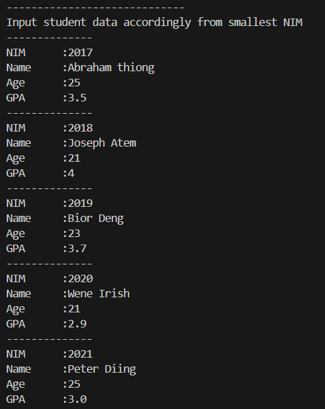
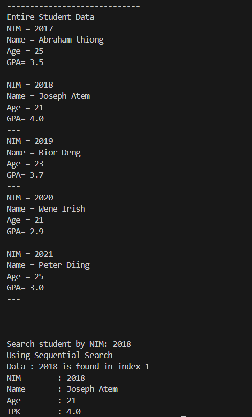
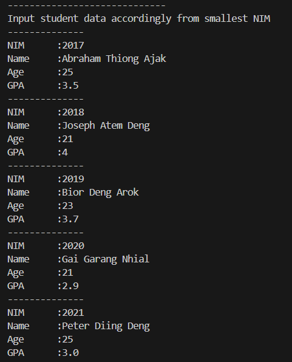
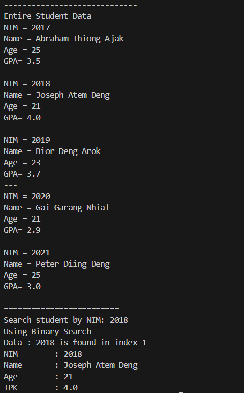
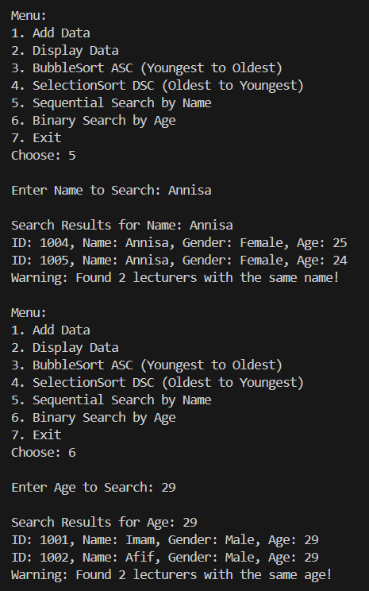
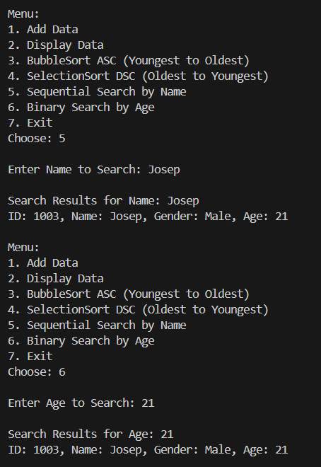
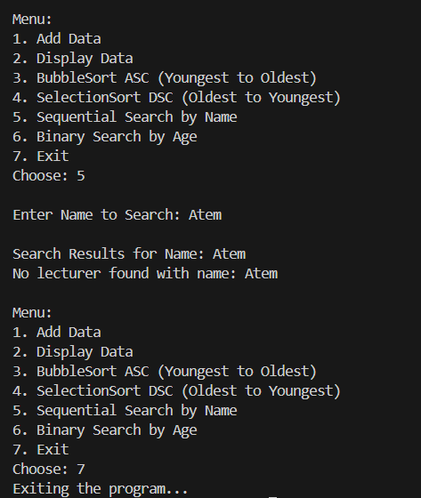

|  | Algorithm and Data Structure |
|--|--|
| NIM | 244107020242 |
| Nama | Joseph Atem Deng Aruei |
| Kelas | TI - 1I |
| Repository | [link](https://github.com/JosephAt10/Semester-Two) |

# Labs #7 Programming Fundamentals Review

## ** Experiment 7.2 Sequential Search Method

1. The solution has been implemented in Student.java and below is the screenshot of the result.




**Brief explanation:**
- A class named Students was created with the required attributes nim, age, name, and gpa, along with a constructor to initialize them and a display method to output the student's data.
- A class named SearchStudent was implemented with methods for adding, displaying, and searching student data using sequential search.
- A new class named MainStudent was created to run the program. It uses a Scanner to take user input for 5 students and fills the student list.
- An object of the SearchStudent class was created in MainStudent, and the add and display methods were called to input and show the student data.
- Sequential Search is implemented and fully functional, allowing the user to search for a student by NIM and view the corresponding position and detailed data.


### **6.2.5 Questions**
1. **What is the difference between the method displayData and displayPostion in studentSearch class?**
- showPosition() displays the index position in the array where the student with the given NIM was found mean while showData() displays the complete student information (NIM, name, age, GPA) if the student is found. 
2. **What is the function of break in this following program code**
```java
if (listedStd[i].nim == search) {
    position = i;
    break;
}
```
- The break statement is used to exit the loop as soon as the desired NIM is found, avoiding unnecessary checks.
3. **If NIM data inserted is not sorted from smallest to biggest value, will the program encounter an error? is the result still correct? why?**
- No error, and the result will still be correct simply because sequential search checks each element one by one regardless of order. 
4. **Look at findSeqSearch method, why position is initialized by -1 instead of 0?**
- -1 is used to indicate that the data was not found because If it were 0, and the data was not in the list, the program would mistakenly assume the student is at index 0.


## ** Experiment 7.3 Binary Search Method

1. The solution has been implemented in Student.java and below is the screenshot of the result.




**Brief explanation:**
- A class named Students was created with the required attributes (nim, age, name, gpa) and a constructor to initialize them, along with a display method to show student information.
- A SearchStudent class was implemented to manage student data, and a binary search method was implemented to search the student by NIM.
- An object of the SearchStudent class was created in MainStudent, and the add and display methods were called to input and show the student data.


### **6.2.5 Questions**
1. **Show the program code in which runs the divide process!**
```java
mid = (left + right) / 2;
```
2. **Show the program code in which runs the conquer process!**
```java
if (listStd[mid].nim == cari) {
    return mid;
} else if (cari < listStd[mid].nim) {
    right = mid - 1;
} else {
    left = mid + 1;
}
```
3. **If inserted NIM data is not sorted, will the program give the correct result (eg 20215,20214, 20212, 20211, 20210) and element being searched is 20210. How is the result of binary search? does it return the correct one? if not then change the code so that the binary search executed properly**
- No, binary search requires the data to be sorted in ascending (or descending) order therefore If the array is unsorted, the logic of "left/mid/right" comparisons breaks, leading to incorrect results.

If NIM is still sorted descending and we search for 20210, will binary search work?
- No, because standard binary search assumes ascending order.
- To make it work, the modification has to be done to the comparison logic as follow
```java
if (cari > listStd[mid].nim) {
    right = mid - 1;
} else {
    left = mid + 1;
}
```
4. **Modify program above so that the students amount inserted is matched with user input**
- Below is the modification of the code
```java
import java.util.Scanner;

public class MainStudent {
    public static void main(String[] args) {
        Scanner s = new Scanner(System.in);

        System.out.print("Enter number of students: ");
        int amountStudent = s.nextInt();
        SearchStudent data = new SearchStudent(amountStudent);
        //other part of the code remain the same
         }
    }
```
- However the SearchStudent class is also modified to accept the size of the parameter as shown below
```java
public class SearchStudent {
    Students[] listStd;
    int idx;
   
    public SearchStudent(int size) {
        listStd = new Students[size];
        idx = 0;
      }
    }
```


## ** Experiment 7.4 Review Divide and Conquer

1. The solution has been implemented in MergeSort.java and below is the screenshot of the result.





**Brief explanation:**
- A Lecturer class was maintained with attributes (id, name, gender, age) and methods to initialize and display lecturer information, serving as the data structure for lecturer records.
- A LecturerData class was enhanced with two new search methods: sequentialSearch() for case-insensitive name searches with multiple-result warnings binarySearch() for age searches (after auto-sorting) with duplicate-age detection.
- The menu system in LecturerDemo was expanded with two new options (5-6) to access the search functionality, including proper input handling for search queries and clear results display.
- Multiple result detection was implemented in both search methods, displaying warnings when duplicate names or ages are found while showing all matching records for comprehensive results.


## **THANK YOU!!!**

