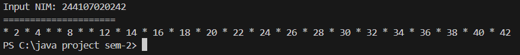

|  | Algorithm and Data Structure |
|--|--|
| NIM |  244107020242|
| Nama |  Joseph Atem Deng Aruei |
| Kelas | TI - 1I |
| Repository | [link] https://github.com/JosephAt10/Semester-Two.git |

# Labs #1 Programming Fundamentals Review

## 2.1.1. Selection Solution

The solution is implemented in Selection.java, and below is screenshot of the result.

**Brief explanaton:** There are 4 main step: 
1. Input all grades
2. Validate the input (If Invalid, repeat the process until we get the input right)
3. Calculate and convert the final grade
4. Decide the final status and show the statistics of the results

## 2.2.1. Looping Solution

The solution is implemented in Looping.java, and below is screenshot of the result.

**Brief explanaton:** There are 7 main step: 
1. Input NIM
2. Use modulo operator to get the last two digits of the NIM (n)
3. Validate whether the two digits are less than 10 or no (if less than 10, then sum the two digits to 10)
4. Use a loop process to display the numbers until it reached the last two digits of the NIM (n)
5. Check every loop whether the number is either 6 or 10. If it's 6 or 10, print a blank String/skip the number.
6. Check if there's a 0 number. If there is, skip the 0 number
7. Checks if the number is even or no. If it's an even number, prints the actual number. If it's an odd number, prints an arterisk.

## 2.3.1. Array Solution

The solution is implemented in Array.java, and below is screenshot of the result.

**Brief explanaton:** There are 4 main step: 
1. Input each Grade for each subject
2. Convert each Grade on each subject into "equivalent value" and Letter Grade
3. Calculate the IP by totaling the whole "equivalent value" and divide it by the length of the courses
4. Display each Numeric Grades, Letter Grades, Bobot equivalent value for each subject and the overall IP

## 2.4.1. Function Solution

The solution is implemented in Selection.java, and below is screenshot of the result.

**Brief explanaton:** There is one main step: 
1. Display the result of that calculation

## 3. Assignment 1 Solution

The solution is implemented in Assignment1.java, and below is screenshot of the result.

**Brief explanaton:** There are 4 main step: 
1. Input the Code
2. Check whether the inputted code matches the code in the cityCode[] Array
3. If not, loops the process until the input is valid
4. If matches, display the city name based on the code

## 3. Assignment 2 Solution

The solution is implemented in Assignment2.java, and below is screenshot of the result.

**Brief explanaton:** There are 4 main step: 
1. Input the Length, width and height
2. Input the calculation type
3. If 1 is choosen, calculate the Volume
4. If 2 is choose, calculate the surface area
5. If 3 is choosen, calculate the perimeter of the cube
4. If 4 is choosen, Exit the program

## 3. Assignment 3 Solution

The solution is implemented in Assignment3.java, and below is screenshot of the result.

**Brief explanaton:** There are 7 main step: 
1. Input the number (n) of courses to input
2. Input the number of course input the sks and input the days
3. Display all courses
4. Display courses on a specific day
5. Display courses for a specific semester
6. Search for a course by name
7. Exit