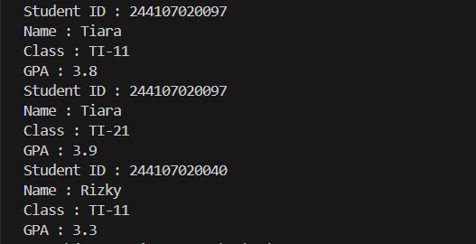

|  | Algorithm and Data Structure |
|--|--|
| NIM | 244107020242 |
| Nama | Joseph Atem Deng Aruei |
| Kelas | TI - 1I |
| Repository | [link](https://github.com/JosephAt10/Semester-Two.git) |

# Labs #2 Programming Fundamentals Review

## **2.1 Experiment 1: Declaring Classes, Attributes, and Methods**

1. The solution is implemented in Student.java, and below is screenshot of the result


**Brief explanaton:**
 1. A class named `Student` was created with the following attributes:
   - studentID (String)
   - name (String)
   - className` (String)
   - gpa (double)
   - Therefore, the progrom can't run since it's lucking main method as shown above.

### **2.1.3 Questions**

1. **Mention two characteristics of a class or object!**
   - **Encapsulation**: A class encapsulates data (attributes) and behavior (methods) into a single unit.
   - **Abstraction**: A class provides a clear structure and hides the internal implementation details from the user.

2. **How many attributes does the Student class have? List them!**
   - The `Student` class has **4 attributes**:
     1. studentID (String)
     2. name (String)
     3. className (String)
     4. gpa (double)

3. **How many methods does the Student class have? List them!**
   - The `Student` class has **4 methods**:
     1. print(): Displays student details.
     2. changeClass(String newClass): Updates the class name.
     3. updateGPA(double newGPA): Updates the GPA.
     4. evaluate(): Evaluates student performance based on GPA.

4. **Modify the `updateGPA()` method to validate that the input GPA is within the range of 0.0 to 4.0. If it is out of range, display a message: "Invalid GPA. Must be between 0.0 and 4.0."**
   
    
    
**Brief explanaton:**   
The `updateGPA()` method was modified to validate that the input GPA is within the range of 0.0 to 4.0. If the input is out of range, it displays the message: "Invalid GPA. Must be between 0.0 and 4.0."

5. **Explain how the `evaluate()` method evaluates student performance. What criteria does it use, and what does it return?**
   - The `evaluate()` method checks the value of the `gpa` attribute and returns a performance evaluation based on the following criteria:
     - If gpa >= 3.5, it returns "Excellent".
     - If gpa >= 3.0, it returns "Good".
     - If gpa >= 2.0, it returns "Fair".
     - If gpa < 2.0, it returns "Poor".


## **2.2 Experiment 2: Object Instantiation and Accessing Attributes and Methods**

The solution is implemented in StudentMain.java, and below is screenshot of the result.

 
 
**Brief explanaton:**
2. The following methods were implemented in the `Student` class:
   - print(): Displays student details.
   - changeClass(String newClass): Updates the class name.
   - updateGPA(double newGPA): Updates the GPA.
   - evaluate(): Evaluates student performance based on GPA.

### **2.2.3 Questions**

1. **Show the line of code in `StudentMain` used for instantiation. What is the name of the created object?**
   - The line of code for instantiation is:
     ```java
     Student student1 = new Student();
     ```
   - The name of the created object is `student1`.

2. **How do you access attributes and methods of an object?**
   - Attributes and methods of an object are accessed using the dot (`.`) operator. For example:
     ```java
     student1.name = "Tiara";
     student1.print();
     ```

3. **Why does the output of the first and second calls to `print()` differ?**
   - The output differs because the `changeClass()` and `updateGPA()` methods are called between the two `print()` calls. These methods modify the `className` and `gpa` attributes, respectively, resulting in different values being printed.

## **2.3 Experiment 3: Creating Constructor**

The solution is implemented in StudentMain.java, and below is screenshot of the result.



### **2.3.3 Questions**

1. **Show the line of code in `Student` used to declare the parameterized constructor.**
   - The line of code for the parameterized constructor is:
     ```java
     public Student(String id, String name, String cls, double gpa) {
         studentID = id;
         this.name = name;
         className = cls;
         this.gpa = gpa;
     }
     ```

2. **In `StudentMain`, explain what the following line of code does:**
   ```java
   Student student2 = new Student("244107020040", "Rizky", "TI-11", 3.5);
 This line of code creates a new Student object named student2 using the parameterized constructor and It initializes the object with the following values:
- studentID = "244107020040"
- name = "Rizky"
- className = "TI-II"
- gpa = 3.5

3. **Remove the default constructor from `Student`, then compile and run the program. What happens? Explain why.**
- If the default constructor is removed, the program will fail to compile when trying to create an object using the default constructor (e.g., Student student1 = new Student();). Because Java requires a default constructor if no constructors are defined

4. **After instantiating an object, do methods in Student need to be accessed in order? Explain.**
- No, methods in the Student class do not need to be accessed in a specific order.

5. **Create a new object named student<StudentName> using the parameterized constructor from Student class.**


## 2.4 Assignment 1 solution

The solution is implemented in Course.java, and below is screenshot of the result.


**Brief explanaton:**
- The `Course` class was implemented with the following:
  - **Attributes**:
    - courseID (String): Unique code for the course.
    - name (String): Full name of the course.
    - credit (int): Semester Credit System (SKS).
    - hour (int): Total weekly meeting hours.
  - **Methods**:
    - print()`: Displays all course details.
    - changeCredit(int newCredit)`: Changes the SKS and informs the user.
    - addHour(int hour): Adds extra hours to the course.
    - reduceHour(int hour): Reduces course hours, ensuring enough hours remain.

## 2.4 Assignment 2 solution


